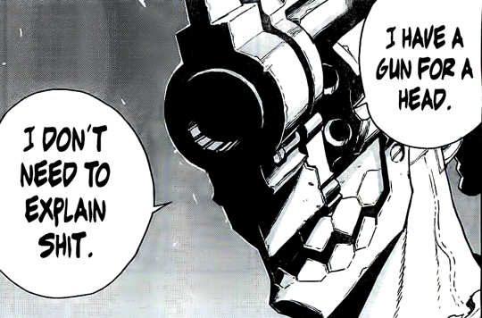

# I-AM-THE-GUN Paper Prototype

### Samenvatting:

Je speelt met 4 spelers, waarbij iedereen drie levens heeft en wat ammunitie. Elke ronde zullen de spelers proberen elkaars levens af te nemen door hun ammunitie naar elkaar te schieten met hun vinger. Maar pas op want als je geen ammunitie meer hebt, heb je enkel nog je levels op te geven. Gelukkig kan je op draconische wijze je jezelf meer ammunitie geven door die te stelen van andere spelers. Laatste speler met levens over wint.

### Onderzoeksdoel:

Het papieren prototype wordt hier gebruikt om te testen of het idee van je eigen "levels" gebruiken als ammunitie en dan ook het daarvan nemen van ammunitie van andere een leuke gameloop is. Het is de bedoeling dat het riskant is, dat je met je level speelt omdat je ammunitie werken als een timer waar je op moet letten. De enige manier om te zorgen dat deze "timer" niet uitloopt is door meer ammunitie van andere te nemen.

### Setup:

##### Materiaal:

* 12 kegels
* 28 stukken ammunitie
* 4 lijnstukken

##### Startposities:

Elke speler plaatst een van hun kegels voor zich. Deze kegel stelt één level voor. Achter deze kegels plaatst de speler een lijnstuk als indicator voor waar hun kogels op moeten staat. Natuurlijk plaatst de speler dan hun 7 kogels volgens dit lijnstuk.

### Verloop van het spel:

##### Voorbeeld ronde:

De jongste speler is eerst aan de beurt en elke speler komt aan de beurt in wijzerzin volgorde. De speler mag bij hun beurt één kogel gebruiken om te schieten op een andere speler naar keuze.

* Of de speler hun doel raakt of niet, de gebruikte kogel ligt nu buiten het spel.
* Als de speler de kegel van een andere speler omstoot, is deze andere speler één leven verloren.
* Als de speler de ammunitie van de andere speler raakt en kogels van het lijnstuk af stoot, krijgt de eerste speler deze kogels om mee te schieten.

Wanneer een speler geen kogels heeft om te schieten zal deze een leven in de plaats moeten gebruiken. De speler zal dan een van hun kegels gebruiken als kogel. Ook deze ligt buiten het spel wanneer gebruikt.

##### Wanneer ligt een speler buiten?

Als een speler geen levens meer heeft ligt deze buiten het spel en is die verloren. Hun kogels blijven liggen en kunnen nog altijd geraakt worden door de andere spelers om hun ammunitie bij te vullen.

##### Wanneer ben je gewonnen?

Als alle andere spelers al hun levens kwijt zijn ben je gewonnen.

